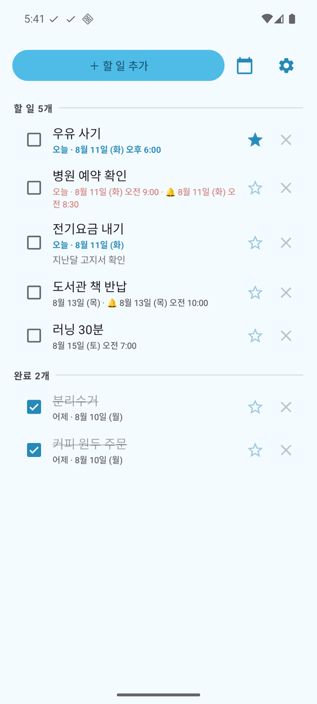
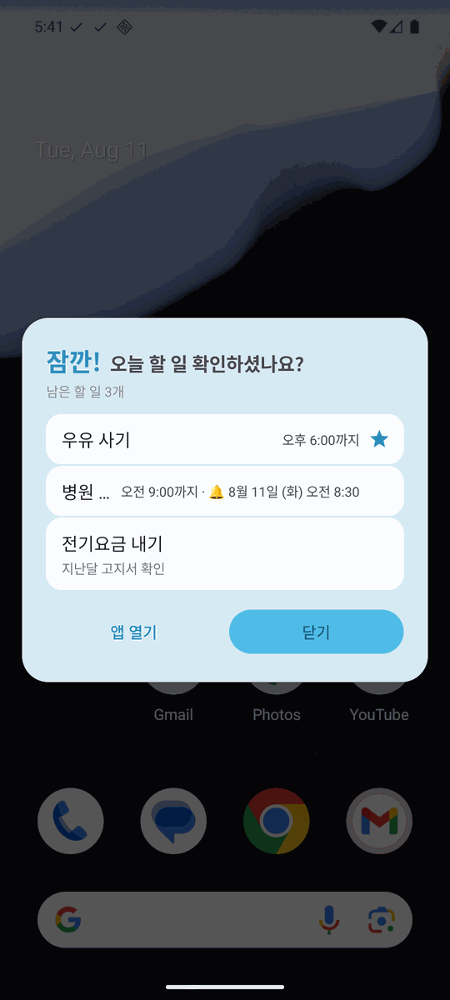
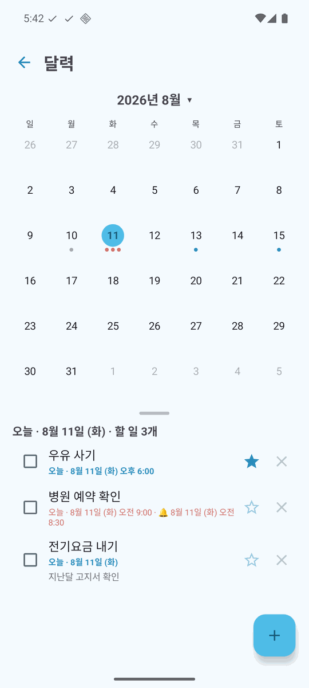
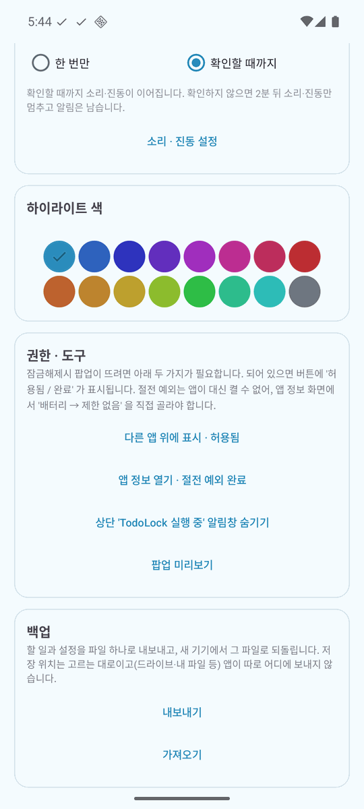
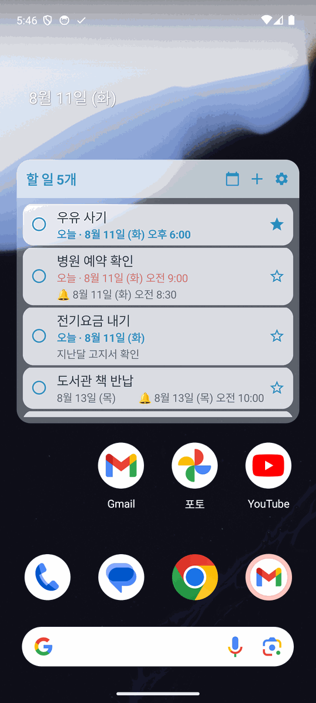

# TodoLock

**잠금을 풀면 오늘 할 일이 먼저 뜨는** 안드로이드 할 일 앱.
남은 할 일이 없으면 아무것도 뜨지 않습니다.

| 할 일 목록 | 잠금해제 직후 | 달력 |
|:---:|:---:|:---:|
|  |  |  |
| 기한 · 중요 · 메모가 한눈에 | **앱을 열지 않아도 찾아옵니다** | 어느 날에 몰려 있는지 |

| 설정 | 홈 화면 위젯 |
|:---:|:---:|
|  |  |
| 알림 방식 · 하이라이트 색 16종 · 백업 | 홈에서 보고 그 자리에서 완료 |

### 받기

**[최신 APK 내려받기](https://github.com/hj0128/todolock/releases/latest)** — 폰에서 받아 누르면 설치됩니다.
처음에는 '이 출처의 앱 설치 허용' 을 한 번 눌러야 합니다.

> 설치 후 **[필수 설정](#설치-후-필수-설정)** 두 가지를 해야 팝업이 뜹니다.

---

## 왜 만들었나

할 일 앱을 깔아놓고 **정작 앱을 열지 않아서** 잊는 것이 문제였습니다.

> 사람은 하루에 수십 번 휴대폰 잠금을 해제합니다.
> 그 순간이 이미 화면을 보고 있는 유일하게 확실한 시점이므로,
> **할 일을 보러 가는 대신 할 일이 찾아오게** 만들었습니다.

알림은 무시하게 되지만 잠금해제 순간의 노출은 효과가 있는 분, 서버 계정 없이
폰 안에만 데이터를 두고 싶은 분에게 맞습니다.

## 무엇을 하나

- **잠금해제하면 오늘 할 일이 뜹니다.** 매번 / 1시간마다 / 하루 1번 중에 고릅니다.
  남은 것이 없으면 뜨지 않고, 팝업에 완료된 항목은 나오지 않습니다.
- **기한과 미리 알림** — 날짜에 시각을 붙일 수 있고, 그보다 앞선 시각에 따로
  알림을 받습니다. 알림창 · 헤드업 · 전체 팝업 중에 고르고, 전체 팝업은
  **확인할 때까지** 울리게 할 수도 있습니다(알람처럼).
- **홈 화면 위젯** — 앱을 열지 않고 보고 · 완료하고 · 추가합니다.
  헤더의 📅 로 위젯 안을 달력으로 바꿀 수 있고, 불투명도와 글자 크기를 조절합니다.
- **달력** — 한 달을 펼쳐 어느 날에 몰려 있는지 봅니다. 날짜를 누르면 그날 목록이
  아래에서 올라옵니다. 좌우로 밀어 달을 넘깁니다.
- **메모 · 중요 표시** — 메모는 목록에 첫 줄만, 알림에는 전문이 나옵니다.
  ★ 는 같은 날짜 안에서 위로 올립니다.
- **백업** — 할 일과 설정을 파일 하나로 내보내고 새 기기에서 되돌립니다.
- **하이라이트 색 16가지** · 다크 모드 · 한국어와 영어(폰 언어를 따라갑니다).

## 설치 후 필수 설정

⚠️ **설치만 하면 잠금해제 팝업은 뜨지 않습니다.** 아래 두 가지는 안드로이드가 앱에
대신 켜주는 것을 허용하지 않아, 사용자가 직접 허용해야 합니다.

앱을 열고 우측 상단 **⚙** → `권한 · 도구` 카드에 필요한 버튼이 모두 있습니다.

| 항목 | 어디서 | 없으면 |
|---|---|---|
| **다른 앱 위에 표시** | ⚙ → `권한 주기` | 팝업이 못 뜨고 **알림으로만** 표시됩니다 |
| **절전 예외** | ⚙ → `앱 정보 열기` → **배터리** → **제한 없음** | 절전이 감지 서비스를 죽여 **팝업이 안 뜨는 날**이 생깁니다 |
| 알림 권한 | 첫 실행 시 자동 요청 | 미리 알림이 오지 않습니다 |
| 알람 및 리마인더 | ⚙ → `앱 정보 열기` → 알람 및 리마인더 | 미리 알림이 **몇 분 늦게** 울립니다 (Android 12+) |

허용되면 버튼 이름이 `다른 앱 위에 표시 · 허용됨`, `앱 정보 열기 · 절전 예외 완료`
로 바뀌므로 그것으로 확인할 수 있습니다.

<details>
<summary><b>삼성(One UI) 을 쓰신다면 하나 더</b></summary>

삼성은 절전이 표준보다 공격적이라 **포그라운드 서비스도 재우거나 종료합니다.**
그러면 잠금해제 시점에 감지가 조용히 멈춥니다.

- ⚙ → **`앱 정보 열기`** → **배터리** → **제한 없음** (위 필수 설정과 같은 경로)

여전히 불안하면 아래도 확인하세요 (One UI 버전에 따라 메뉴가 없을 수 있습니다).

- 설정 → 배터리 → 기타 배터리 설정 → **사용하지 않는 앱을 절전 상태로 전환** 끄기
- 설정 → 배터리 → 백그라운드 사용 제한 → **절전 모드로 전환하지 않는 앱** → `+` 로 TodoLock 추가

삼성 전용 화면들은 공개 인텐트가 없어 앱이 직접 열 수 없습니다. 그래서 앱 정보
화면까지만 데려다주고 마지막 한 번은 직접 고르는 방식입니다.

</details>

## 팝업이 안 뜰 때

| 증상 | 원인과 해결 |
|---|---|
| 팝업 대신 알림으로 뜬다 | `다른 앱 위에 표시` 권한이 없습니다. ⚙ → `권한 주기` |
| 며칠은 잘 되다가 안 된다 | 절전이 서비스를 죽인 것입니다. ⚙ → `앱 정보 열기` → 배터리 → `제한 없음` |
| 아무것도 안 뜬다 | 오늘 **남은** 할 일이 없으면 표시하지 않습니다 |
| 하루에 한 번만 뜬다 | ⚙ → `표시 빈도` 가 `하루 1번` 입니다 |
| 잘 뜨는지 미리 보고 싶다 | ⚙ → `팝업 미리보기` |

앱을 열 때마다 서비스가 죽어 있으면 스스로 다시 시작하고, 워치독이 15분마다
되살립니다. 그래서 위 설정이 어렵다면 하루 한 번 앱을 열어주는 것으로도
대체로 동작합니다.

## 개인정보

`INTERNET` 권한이 없습니다. 할 일은 기기 안에만 저장되며 어디에도 전송되지 않고,
계정 · 로그인 · 광고 · 분석 도구가 없습니다.

---

## 기술 스택

- **Kotlin** + Android View 시스템 (ViewBinding), Material Components
- **minSdk 24 / targetSdk 34** — Android 7.0 이상, 제조사 무관
- 저장소는 **SharedPreferences + JSON** — Room · 애노테이션 프로세서 없음
- 외부 라이브러리는 AndroidX / Material 뿐. **네트워크 코드 없음**
- 달력 칸은 `View.onDraw` 로 직접 그립니다 — 42칸을 XML 로 불려 쓰니 화면 여는
  데 1.8초가 걸렸고, 직접 그려 1초 아래로 내렸습니다
- **GitHub Actions** — 푸시마다 빌드를 검증하고, `v*` 태그를 붙였을 때만
  서명된 APK 를 릴리즈로 올립니다(태그와 `versionName` 이 다르면 실패시킵니다)

## 동작 방식

```
잠금해제
   ├─ ACTION_USER_PRESENT ───────────┐  (정석 경로)
   └─ ACTION_SCREEN_ON → 키가드 감시 ─┤  (USER_PRESENT 가 안 오는 기기 대비)
                                      ↓
UnlockService (포그라운드 서비스, 알림 중요도 MIN)
  └─ UnlockReceiver 가 런타임 등록되어 브로드캐스트 수신
                                      ↓
오늘 날짜에 '미완료' 할 일이 있는가?
   ├─ 없음 → 아무것도 안 함
   └─ 있음 → 곧바로 TodayPopupActivity 표시
              (overlay 권한 없으면 → 헤드업 알림으로 대체)

Watchdog (AlarmManager, 15분 간격) ─→ 서비스가 죽어 있으면 다시 세움
```

미리 알림은 이 경로와 **완전히 별개**입니다. `AlarmManager` 가 시각이 되면
매니페스트에 등록된 `ReminderReceiver` 를 직접 깨우므로 앱이 꺼져 있어도 웁니다.
알람은 재부팅 · 앱 교체로 사라지므로 그때마다 다시 세우고, 그 사이 지나버린
알림은 **12시간 이내면 지금이라도** 띄웁니다(중복 방지는 `Todo.notified`).
